# LowCodeX UI设计文档

## 目录

1. [设计原则](#设计原则)
2. [色彩系统](#色彩系统)
3. [排版系统](#排版系统)
4. [布局系统](#布局系统)
5. [组件设计](#组件设计)
   - [表单设计器](#表单设计器)
   - [工作流设计器](#工作流设计器)
   - [数据模型设计器](#数据模型设计器)
   - [页面设计器](#页面设计器)
6. [响应式设计](#响应式设计)
7. [交互设计](#交互设计)
8. [主题系统](#主题系统)

## 设计原则

LowCodeX 平台的UI设计遵循以下核心原则：

1. **简洁高效** - 减少干扰，突出重点，帮助用户高效完成任务
2. **一致性** - 视觉和交互模式保持一致，降低学习成本
3. **灵活性** - 适应不同场景和用户需求的灵活配置
4. **专业性** - 面向专业领域用户，提供精准而强大的功能
5. **反馈清晰** - 用户操作后提供及时、明确的反馈

## 色彩系统

LowCodeX 平台采用专业、现代的色彩系统，确保界面赏心悦目且功能清晰。

### 主色调

```
主品牌色：#1890FF
辅助色：#1890FF (10% - 90% 色阶变化)
```


### 功能色

```
成功色：#52C41A
警告色：#FAAD14
错误色：#F5222D
信息色：#1890FF
```

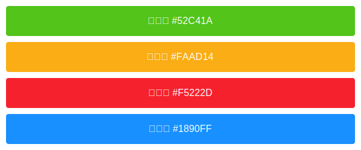

### 中性色

```
标题文字：#262626
主要文字：#595959
次要文字：#8C8C8C
辅助文字：#BFBFBF
边框色：#D9D9D9
分割线：#F0F0F0
背景色：#F5F5F5
表格头部：#FAFAFA
```

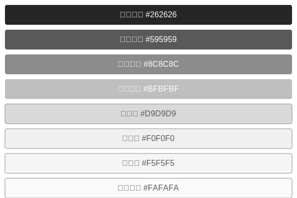

## 排版系统

LowCodeX 平台采用清晰、易读的排版系统，确保内容层次分明，提升用户体验。

### 字体

```
默认字体：-apple-system, BlinkMacSystemFont, 'Segoe UI', Roboto, 'Helvetica Neue', Arial, 'Noto Sans', sans-serif
代码字体：'SFMono-Regular', Consolas, 'Liberation Mono', Menlo, Courier, monospace
```

### 字号与行高

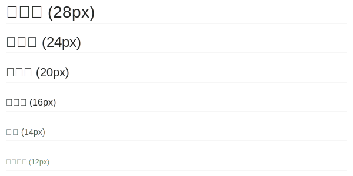

### 字重

```
极细体: 100
细体: 300
常规体: 400
中黑体: 500
黑体: 600
极黑体: 700
```

## 布局系统

LowCodeX 平台采用灵活、一致的布局系统，确保各类功能设计器有统一的操作体验。

### 基础栅格系统

平台基于24列栅格系统进行布局设计，支持响应式设计，适应不同尺寸的屏幕。

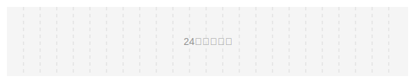

### 间距标准

基于8px倍数的间距系统，保证界面布局整齐统一。

```
超小间距: 4px
小间距: 8px
中间距: 16px
大间距: 24px
超大间距: 32px
```


### 常用布局模式

#### 经典三栏式设计器布局

LowCodeX 平台的设计器普遍采用三栏式布局，左侧为工具/组件面板，中间为设计画布，右侧为属性配置面板。

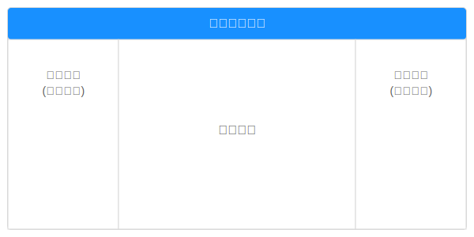

#### 应用页面布局

LowCodeX 平台的应用界面采用现代企业级应用的布局结构。

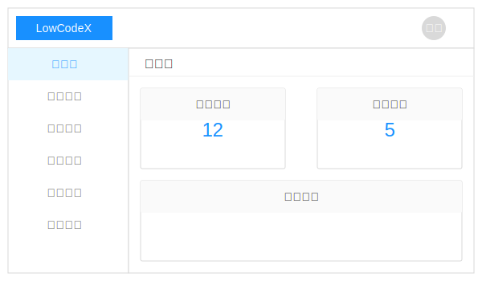

## 组件设计

LowCodeX 平台的核心功能模块采用统一的设计语言，以确保用户在不同模块间切换时能保持一致的体验。

### 表单设计器

表单设计器是LowCodeX平台的核心功能之一，用于可视化构建数据录入表单。

#### 整体布局设计

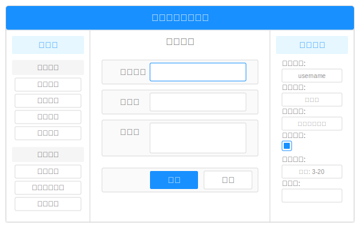

#### 组件设计规范

表单设计器中的组件遵循以下设计规范：

1. **视觉一致性**
   - 所有组件使用统一的圆角值(2px)
   - 统一的边框颜色(#D9D9D9)和聚焦状态边框颜色(#1890FF)
   - 统一的内间距(水平12px，垂直8px)

2. **状态表现**
   - 默认状态：白底灰边框
   - 聚焦状态：白底蓝边框
   - 禁用状态：浅灰底灰边框
   - 错误状态：白底红边框
   - 成功状态：白底绿边框

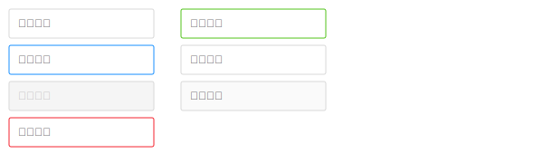

#### 表单组件类型

LowCodeX 平台提供丰富的表单组件类型，满足各种业务场景需求：

1. **输入型组件**
   - 文本输入框
   - 密码输入框
   - 数字输入框
   - 电话号码输入
   - 邮箱输入
   - 多行文本框

2. **选择型组件**
   - 单选框
   - 多选框
   - 下拉选择框
   - 日期选择器
   - 时间选择器
   - 滑块选择器
   - 颜色选择器

3. **上传型组件**
   - 单文件上传
   - 多文件上传
   - 图片上传
   - 头像上传

4. **展示型组件**
   - 文本展示
   - 图片展示
   - 状态标签
   - 进度条
   - 评分组件

5. **布局型组件**
   - 分组框
   - 标签页
   - 步骤条
   - 折叠面板
   - 分割线
   - 卡片容器

### 工作流设计器

工作流设计器是LowCodeX平台的核心功能模块，用于可视化构建业务流程。

#### 整体布局设计

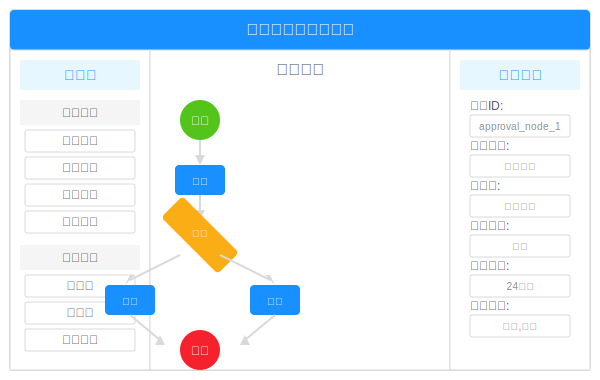

#### 节点设计规范

工作流设计器中的节点遵循以下设计规范：

1. **形状与色彩**
   - 开始/结束节点：圆形，蓝色边框
   - 任务节点：矩形，蓝色边框
   - 审批节点：矩形，绿色边框
   - 条件节点：菱形，橙色边框
   - 自动节点：矩形，紫色边框
   - 错误处理节点：矩形，红色边框

2. **连接线规范**
   - 标准连接线：实线箭头
   - 条件分支：虚线箭头，附带条件标签
   - 默认路径：点划线箭头
   - 箭头颜色与起始节点边框颜色保持一致

<svg width="600" height="180" xmlns="http://www.w3.org/2000/svg">
  <!-- 开始节点 -->
  <circle cx="40" cy="30" r="20" fill="#E6F7FF" stroke="#1890FF" stroke-width="1.5" />
  <text x="40" y="35" font-family="Arial" font-size="12" text-anchor="middle" fill="#1890FF">开始</text>

  <!-- 任务节点 -->
  <rect x="10" y="70" width="60" height="35" rx="2" fill="#FFF" stroke="#1890FF" stroke-width="1.5" />
  <text x="40" y="92" font-family="Arial" font-size="12" text-anchor="middle" fill="#595959">任务</text>

  <!-- 审批节点 -->
  <rect x="10" y="120" width="60" height="35" rx="2" fill="#FFF" stroke="#52C41A" stroke-width="1.5" />
  <text x="40" y="142" font-family="Arial" font-size="12" text-anchor="middle" fill="#595959">审批</text>

  <!-- 条件节点 -->
  <polygon points="140,30 160,50 140,70 120,50" fill="#FFF" stroke="#FAAD14" stroke-width="1.5" />
  <text x="140" y="54" font-family="Arial" font-size="12" text-anchor="middle" fill="#595959">条件</text>

  <!-- 自动节点 -->
  <rect x="110" y="90" width="60" height="35" rx="2" fill="#FFF" stroke="#722ED1" stroke-width="1.5" />
  <text x="140" y="112" font-family="Arial" font-size="12" text-anchor="middle" fill="#595959">自动</text>

  <!-- 错误处理节点 -->
  <rect x="110" y="140" width="60" height="35" rx="2" fill="#FFF" stroke="#F5222D" stroke-width="1.5" />
  <text x="140" y="162" font-family="Arial" font-size="12" text-anchor="middle" fill="#595959">错误</text>

  <!-- 结束节点 -->
  <circle cx="240" cy="30" r="20" fill="#FFF" stroke="#1890FF" stroke-width="1.5" />
  <text x="240" y="35" font-family="Arial" font-size="12" text-anchor="middle" fill="#1890FF">结束</text>

  <!-- 标准连接线 -->
  <line x1="220" y1="70" x2="280" y2="70" stroke="#1890FF" stroke-width="1.5" />
  <polygon points="275,66 285,70 275,74" fill="#1890FF" />
  <text x="250" y="65" font-family="Arial" font-size="10" fill="#8C8C8C">标准连接线</text>

  <!-- 条件连接线 -->
  <line x1="220" y1="110" x2="280" y2="110" stroke="#FAAD14" stroke-width="1.5" stroke-dasharray="5,2" />
  <polygon points="275,106 285,110 275,114" fill="#FAAD14" />
  <text x="250" y="105" font-family="Arial" font-size="10" fill="#8C8C8C">条件连接线</text>

  <!-- 默认路径 -->
  <line x1="220" y1="150" x2="280" y2="150" stroke="#1890FF" stroke-width="1.5" stroke-dasharray="10,2,2,2" />
  <polygon points="275,146 285,150 275,154" fill="#1890FF" />
  <text x="250" y="145" font-family="Arial" font-size="10" fill="#8C8C8C">默认路径</text>
</svg>

#### 工作流组件类型

LowCodeX 平台工作流设计器支持丰富的节点类型，满足各类业务流程需求：

1. **基础节点**
   - 开始节点
   - 结束节点
   - 任务节点
   - 审批节点
   - 条件节点
   - 并行网关
   - 会签节点

2. **高级节点**
   - 子流程节点
   - 定时触发节点
   - 消息触发节点
   - 脚本节点
   - 服务调用节点
   - 数据操作节点
   - 人工干预节点

3. **特殊节点**
   - 等待节点
   - 异常处理节点
   - 取消节点
   - 挂起节点
   - 重试节点

### 数据模型设计器

数据模型设计器是LowCodeX平台的基础功能模块，用于可视化定义业务数据结构。

#### 整体布局设计

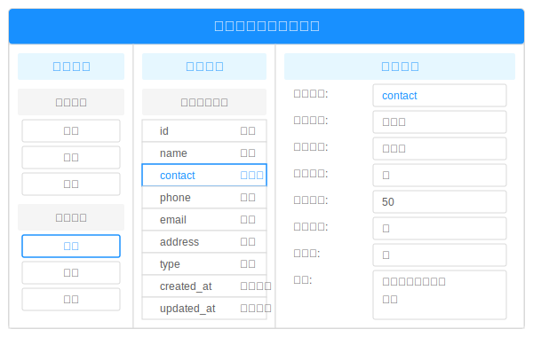

#### 数据模型组件设计规范

数据模型设计器的UI组件遵循以下设计规范：

1. **实体节点**
   - 标准卡片样式，圆角为2px
   - 实体名称使用加粗字体
   - 实体类型通过不同的边框颜色区分
   - 系统实体：蓝色边框
   - 业务实体：绿色边框
   - 关联实体：橙色边框

2. **字段列表**
   - 表格式布局，清晰展示字段信息
   - 主键字段名称加粗显示
   - 必填字段使用绿色勾标识
   - 非必填字段使用灰色叉标识
   - 关联字段名称使用斜体显示

3. **关系连接线**
   - 一对一关系：实线连接，双箭头
   - 一对多关系：实线连接，单箭头
   - 多对多关系：虚线连接，双箭头
   - 关系类型通过连接线颜色区分

### 页面设计器

页面设计器是LowCodeX平台的高级功能模块，用于可视化构建应用界面。

#### 整体布局设计

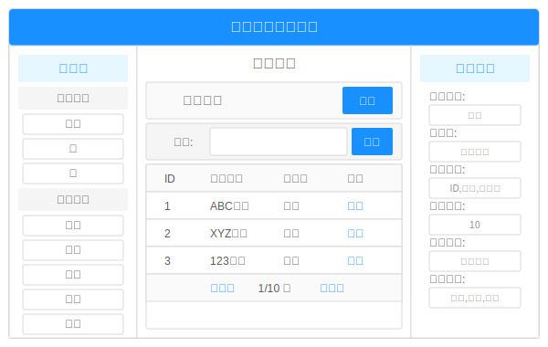

## 响应式设计

LowCodeX 平台采用响应式设计，确保应用在不同设备和屏幕尺寸下都能提供良好的用户体验。

### 栅格系统

响应式布局基于24列栅格系统，通过自动调整列宽和布局实现不同屏幕尺寸的适配。

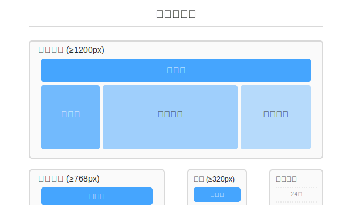

### 断点设计

以下断点用于定义不同设备下的布局行为：

| 断点名称 | 宽度范围 | 典型设备 |
|--------|---------|---------|
| xs     | <576px  | 手机竖屏 |
| sm     | ≥576px  | 手机横屏 |
| md     | ≥768px  | 平板设备 |
| lg     | ≥992px  | 桌面显示器 |
| xl     | ≥1200px | 大型桌面显示器 |
| xxl    | ≥1600px | 超大型桌面显示器 |

### 布局调整策略

1. **内容布局调整**
   - 大屏（≥992px）：多列布局，充分利用水平空间
   - 中屏（≥768px）：减少列数，适当调整内容密度
   - 小屏（<768px）：单列布局，优先展示核心内容

2. **导航布局调整**
   - 大屏：水平导航栏 + 侧边菜单
   - 中屏：折叠侧边菜单 + 顶部导航
   - 小屏：隐藏侧边菜单，提供汉堡按钮展开

3. **表单布局调整**
   - 大屏：多列表单布局，标签在左侧
   - 中屏：双列表单布局，标签在上方
   - 小屏：单列表单布局，标签在上方

## 主题系统

LowCodeX 平台提供强大的主题系统，支持自定义品牌风格和深浅色模式切换。

### 主题变量体系

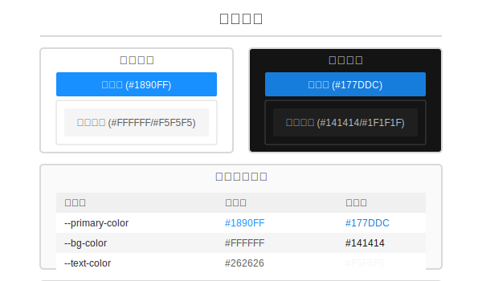

### 预设主题方案

平台提供以下预设主题方案，用户可一键切换：

1. **默认企业蓝**
   - 主色：#1890FF
   - 强调色：#40A9FF
   - 成功色：#52C41A
   - 警告色：#FAAD14
   - 错误色：#F5222D

2. **科技紫**
   - 主色：#722ED1
   - 强调色：#9254DE
   - 成功色：#52C41A
   - 警告色：#FAAD14
   - 错误色：#F5222D

3. **商务绿**
   - 主色：#13C2C2
   - 强调色：#36CFC9
   - 成功色：#52C41A
   - 警告色：#FAAD14
   - 错误色：#F5222D

4. **活力橙**
   - 主色：#FA8C16
   - 强调色：#FFA940
   - 成功色：#52C41A
   - 警告色：#FAAD14
   - 错误色：#F5222D

### 主题切换机制

主题切换通过以下机制实现：

1. **CSS变量覆盖**
   - 使用CSS变量定义颜色、边距等主题属性
   - 切换主题时替换根节点上的CSS变量值

2. **组件样式自适应**
   - 所有组件基于主题变量构建
   - 确保UI一致性和风格连贯性

3. **深色模式适配**
   - 针对深色模式优化各组件样式
   - 确保文本可读性和对比度

## 交互设计

LowCodeX 平台的交互设计旨在提供流畅、直观的用户体验，减少学习成本。

### 拖拽交互

平台采用直观的拖拽交互方式，用于页面设计、流程设计等场景：

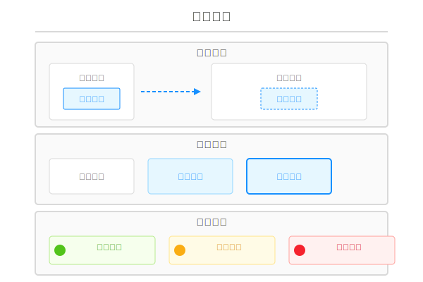

### 状态反馈

组件状态反馈遵循以下原则：

1. **悬停状态 (Hover)**
   - 轻微的背景色变化或阴影增强
   - 指示元素可交互

2. **激活状态 (Active)**
   - 明显的颜色变化或形状变化
   - 指示用户操作正在处理

3. **选中状态 (Selected)**
   - 持久的边框高亮或背景色变化
   - 指示当前选中的元素

4. **禁用状态 (Disabled)**
   - 降低不透明度和对比度
   - 指示元素当前不可用

### 消息提示

平台提供以下类型的消息提示，确保用户及时获取操作反馈：

1. **成功消息**
   - 绿色图标和边框
   - 用于操作成功的确认

2. **信息消息**
   - 蓝色图标和边框
   - 用于一般提示和通知

3. **警告消息**
   - 黄色图标和边框
   - 用于需要注意的提示

4. **错误消息**
   - 红色图标和边框
   - 用于错误和失败提示

### 动画效果

平台使用适度的动画效果增强用户体验：

1. **过渡动画**
   - 页面切换时的淡入淡出
   - 组件展开收起的平滑过渡
   - 持续时间控制在300ms以内，保持流畅

2. **反馈动画**
   - 按钮点击时的波纹效果
   - 加载状态的旋转动画
   - 成功/失败的图标动画

## 文档结束

本文档概述了LowCodeX平台的UI设计规范和组件设计标准，旨在指导开发团队和用户创建具有一致性和专业性的低代码应用。

UI设计文档将随着平台的发展持续更新，确保设计系统与功能演进保持同步。
